# Architecture & Modèle de Données Backend (Base de Données) — SD Cosmétique

Ce document constitue la **référence architecturale complète en français** de la base de données du backend SD Cosmétique (architecture API Laravel 13 / MariaDB / Filament 5). 

Il détaille l'ensemble des **44 tables** (43 tables de domaine + la table de sessions Sanctum), leurs **relations (cardinalités, clés étrangères et liaisons polymorphes)** ainsi que leur **rôle et cas d'usage métier** dans le contexte du commerce cosmétique en Côte d'Ivoire (paiements Mobile Money, carnations cutanées, diagnostic de peau, gestion logistique locale).

---

## Sommaire

1. [Vue d'Ensemble & Diagramme Macro](#1-vue-densemble--diagramme-macro)
2. [Module 1 : Identité, Clients & Sécurité (RBAC)](#2-module-1--identité-clients--sécurité-rbac)
3. [Module 2 : Adresses & Logistique Géographique](#3-module-2--adresses--logistique-géographique)
4. [Module 3 : Catalogue, Variantes & Attributs](#4-module-3--catalogue-variantes--attributs)
5. [Module 4 : Inventaire & Traçabilité des Stocks](#5-module-4--inventaire--traçabilité-des-stocks)
6. [Module 5 : Commandes, Expéditions & Historique](#6-module-5--commandes-expéditions--historique)
7. [Module 6 : Passerelles de Paiement & Transactions Fintech](#7-module-6--passerelles-de-paiement--transactions-fintech)
8. [Module 7 : Programme de Fidélité (Jeko Ledger)](#8-module-7--programme-de-fidélité-jeko-ledger)
9. [Module 8 : Promotions, Avis Clients & UGC](#9-module-8--promotions-avis-clients--ugc)
10. [Module 9 : Diagnostic de Peau (Quiz & Recommandations)](#10-module-9--diagnostic-de-peau-quiz--recommandations)
11. [Module 10 : Tables Polymorphes Transverses](#11-module-10--tables-polymorphes-transverses)
12. [Module 11 : Paramètres & Configuration Système](#12-module-11--paramètres--configuration-système)
13. [Patterns Architecturaux & Règles d'Intégrité](#13-patterns-architecturaux--règles-dintégrité)
14. [Matrice Récapitulative des 44 Tables](#14-matrice-récapitulative-des-44-tables)

---

## 1. Vue d'Ensemble & Diagramme Macro

La base de données est découpée en **11 modules cohérents**, conçus selon les principes de haute cohésion et de faible couplage (Domain-Driven Design).

```mermaid
flowchart TB
    subgraph IAM["1. Identité & Sécurité"]
        U[users] --- C[clients]
        U --- R[roles]
        U --- S[sessions]
    end

    subgraph CATALOG["2. Catalogue & Variantes"]
        CAT[categories] --- P[products]
        P --- PV[product_variants]
        PV --- ATTR[attributes & values]
    end

    subgraph STOCK["3. Inventaire"]
        PV --- INV[inventory_items]
        INV --- SM[stock_movements]
    end

    subgraph SALES["4. Commandes & Logistique"]
        O[orders]
        C -.-> O
        O --- OC[order_customers]
        O --- OA[order_adjustments]
        O --- OI[order_items]
        PV -.-> OI
        O --- SHIP[shipments]
        SHIP --- SI[shipment_items]
        OI -.-> SI
        O --- OSH[order_status_history]
    end

    subgraph FINTECH["5. Paiements"]
        PG[payment_gateways] --- PT[payment_transactions]
        O --- PT
        PG --- PWL[payment_webhook_logs]
    end

    subgraph LOYALTY["6. Fidélité Jeko"]
        C --- LA[loyalty_accounts]
        LA --- LL[loyalty_ledger]
        O -.-> LL
    end

    subgraph QUIZ["7. Diagnostic Peau"]
        QQ[quiz_questions] --- QO[quiz_options]
        P -.-> QR[quiz_rules]
        C -.-> QS[quiz_submissions]
        QS --- QA[quiz_answers]
    end

    subgraph UGC["8. UGC & Marketing"]
        P --- PR[product_reviews]
        C -.-> PR
        CP[coupons] -.-> OA
        TEST[testimonials]
        NEWS[newsletter_subscribers]
    end

    subgraph POLY["9. Services Transverses (Polymorphes)"]
        ADDR[addresses]
        MED[media]
        TAG[tags & taggables]
        SEO[seo]
        AUD[audit_logs]
        NOTIF[notification_logs]
    end

    subgraph CONFIG["10. Configuration & Tarifs"]
        SETT[settings]
        SZ[shipping_zones]
    end

    ADDR -.-> C
    ADDR -.-> O
    MED -.-> P
    MED -.-> PV
    MED -.-> CAT
    TAG -.-> P
    SEO -.-> P
    SEO -.-> CAT
    SZ -.-> OA
```

---

## 2. Module 1 : Identité, Clients & Sécurité (RBAC)

Ce module sépare rigoureusement le compte d'authentification (`users`), le profil client cosmétique (`clients`), et les droits d'administration (`roles` + `role_user`).

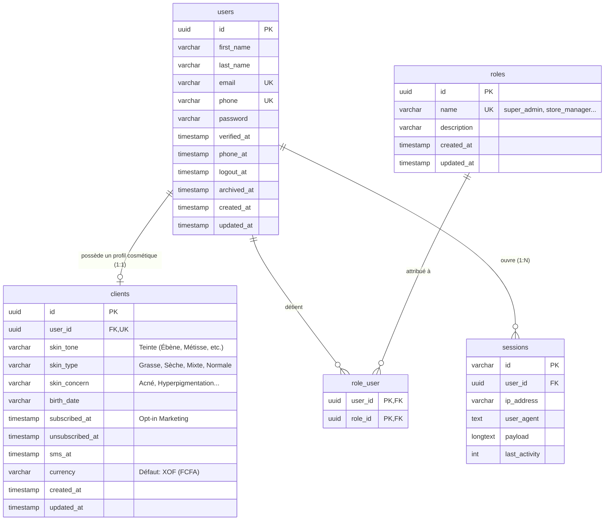

### Explication des tables et de leurs usages :
1. **`users`** : Table racine de tous les comptes humains (clients de la boutique, préparateurs de commandes, gestionnaires de stock, administrateurs). Elle centralise les identifiants uniques (email, téléphone) et le mot de passe hashé.
2. **`clients`** : Profil métier e-commerce et beauté rattaché à l'utilisateur (`user_id` unique). Il stocke les données de personnalisation cutanée (carnation `skin_tone`, type de peau `skin_type`, besoins `skin_concern`) permettant de recommander les teintes de fond de teint et les routines adaptées.
3. **`roles` & `role_user`** : Modèle de contrôle d'accès basé sur les rôles (RBAC) standard Laravel/Filament (Décision A4). Évite les colonnes `role` rigides ou une table `admins` séparée. Rôles supportés : `super_admin`, `store_manager`, `support_operator`, `warehouse_operator`, `customer`.
4. **`sessions`** : Gestion des sessions sécurisées Laravel Sanctum en mode Cookie SPA (utilisé pour Next.js côté web et Filament côté admin).

---

## 3. Module 2 : Adresses & Logistique Géographique

Gère la localisation adaptée au contexte ivoirien et ouest-africain (adresses descriptives, points relais, communes et repères visuels).

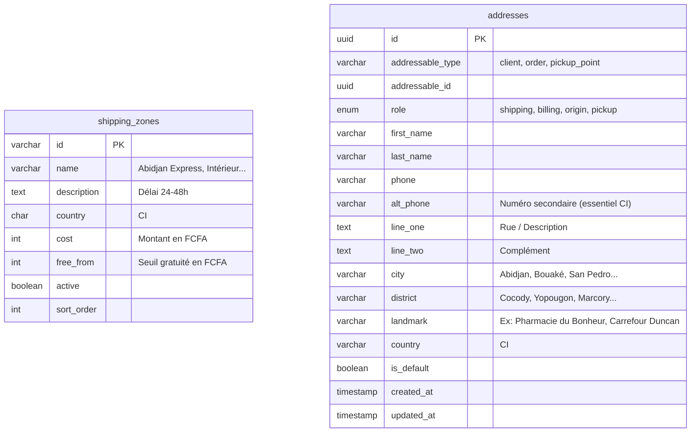

### Explication des tables et de leurs usages :
1. **`addresses` (Table polymorphe)** : Stocke aussi bien les adresses du carnet d'adresses d'un `client` que l'adresse de livraison figée attachée à une `order`.
   - **Champs spécifiques Afrique** : `district` (commune), `landmark` (repère géographique indispensable pour les livreurs moto à Abidjan), et `alt_phone` (téléphone secondaire en cas d'injoignabilité).
2. **`shipping_zones`** : Grille tarifaire dynamique des zones de livraison. Permet de définir les coûts d'expédition (ex: Abidjan 1 500 FCFA, Intérieur 3 500 FCFA) et les seuils de gratuité (ex: offert dès 25 000 FCFA d'achat).

---

## 4. Module 3 : Catalogue, Variantes & Attributs

Modèle de catalogue e-commerce complet gérant les produits maîtres, les variantes physiques (SKU), les attributs (teintes, contenances) et la taxonomie arborescente.

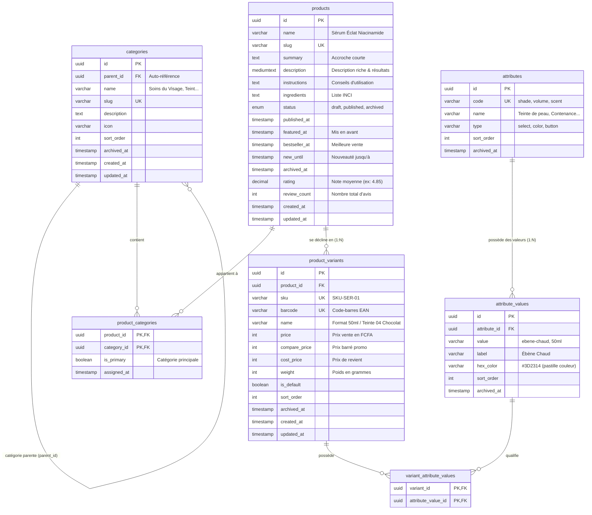

### Explication des tables et de leurs usages :
1. **`categories`** : Taxonomie arborescente illimitée (`parent_id` auto-référencé) pour classer les produits (ex: Soins Visage > Sérums > Anti-taches).
2. **`products`** : Fiche conceptuelle d'un produit (nom, SEO, description clinique, ingrédients, statut de publication).
3. **`product_variants`** : L'unité physique vendable (SKU). C'est la variante qui porte le prix en FCFA (`price`), le code-barres et le poids pour l'expédition.
4. **`attributes` & `attribute_values`** : Définition dynamique des attributs cosmétiques (pastilles de teintes avec code hexadécimal `#hex_color`, volumes `30ml`, `50ml`).
5. **`variant_attribute_values`** : Pivot reliant chaque déclinaison produit à ses attributs précis.

---

## 5. Module 4 : Inventaire & Traçabilité des Stocks

Ce module applique le principe comptable du **grand livre immuable** (*double-entry / audit ledger*) pour la gestion des stocks.

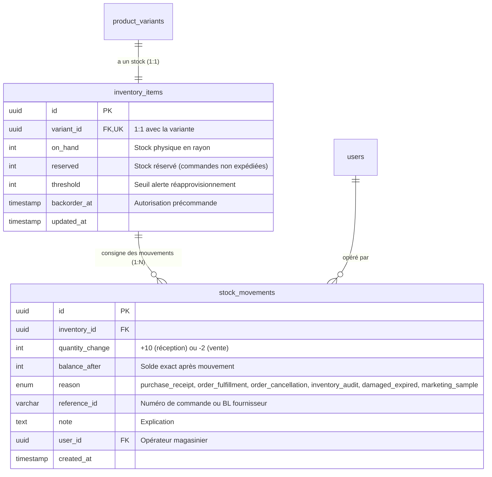

### Explication des tables et de leurs usages :
1. **`inventory_items`** : État instantané du stock pour chaque variante. Le stock réellement disponible à la vente est calculé dynamiquement : `disponible = on_hand - reserved`.
2. **`stock_movements`** : Historique inaltérable de chaque mouvement de stock. Toute entrée ou sortie exige une ligne dans ce grand livre avec la raison (`reason`), la référence du document (`reference_id`) et le nouveau solde (`balance_after`).

---

## 6. Module 5 : Commandes, Expéditions & Historique

Ce module est le cœur transactionnel de la boutique. Il implémente les décisions d'architecture critiques : **l'immutabilité des commandes (A1, A3)**, le découpage des ajustements financiers (`order_adjustments`), la capture figée du client (`order_customers`) et la traçabilité des colis (`shipments`).

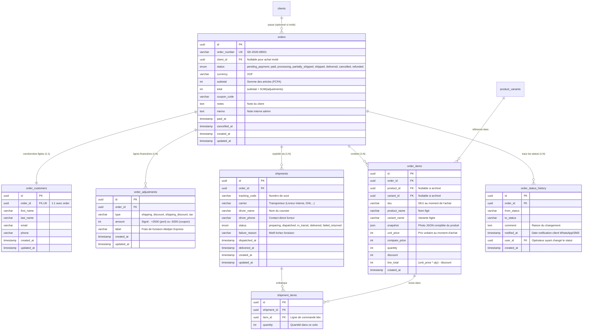

### Explication des tables et de leurs usages :
1. **`orders`** : Table maîtresse de la commande. Conformément à la décision **A1**, elle ne stocke pas de colonnes rigides `shipping_cost` ou `discount`, mais uniquement `subtotal` et `total`.
2. **`order_customers` (Décision A3)** : Snapshot immuable des coordonnées de contact de l'acheteur (nom, prénom, email, téléphone). Rempli systématiquement, que l'acheteur soit connecté ou invité (*guest*). Garantit la conformité légale des factures même si le client modifie son profil ultérieurement.
3. **`order_adjustments` (Décision A1)** : Lignes de décomposition financière (frais de port, rabais coupon, remise de points fidélité). Permet d'ajouter des ajustements arbitraires sans modifier le schéma de `orders` : `total = subtotal + SUM(adjustments.amount)`.
4. **`order_items`** : Lignes d'articles commandés avec capture instantanée `snapshot` (JSON) contenant le visuel, la composition et le titre du produit lors de la vente.
5. **`shipments` & `shipment_items`** : Gestion des expéditions physiques et des coursiers/livreurs moto. Permet l'expédition fractionnée en plusieurs colis (`partially_shipped`).
6. **`order_status_history`** : Audit trail de toutes les étapes de la commande (du paiement à la livraison effective) avec horodatage des notifications envoyées au client.

---

## 7. Module 6 : Passerelles de Paiement & Transactions Fintech

Gère l'écosystème fintech ivoirien (Wave, Orange Money, MTN MoMo, Moov Money, Djamo, Cartes Bancaires, Paiement à la livraison).

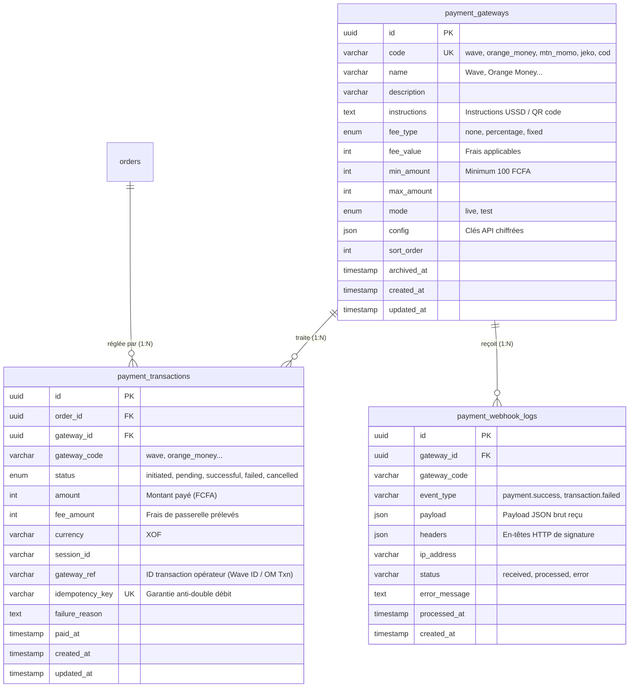

### Explication des tables et de leurs usages :
1. **`payment_gateways`** : Configuration administrative de chaque mode de paiement (instructions USSD, clés secrètes, statut d'activation).
2. **`payment_transactions`** : Historique financier de chaque tentative de débit liée à une commande. Contient une clé d'idempotence (`idempotency_key`) évitant tout double débit en cas de coupure réseau.
3. **`payment_webhook_logs`** : Journal brut inaltérable de tous les webhooks envoyés par les serveurs des opérateurs de paiement (Wave, Jeko Pay). Permet d'auditer les échecs et de rejouer des événements en cas d'erreur réseau.

---

## 8. Module 7 : Programme de Fidélité (Jeko Ledger)

Implémente le programme de fidélité par points selon le modèle comptable immuable (*Ledger*).

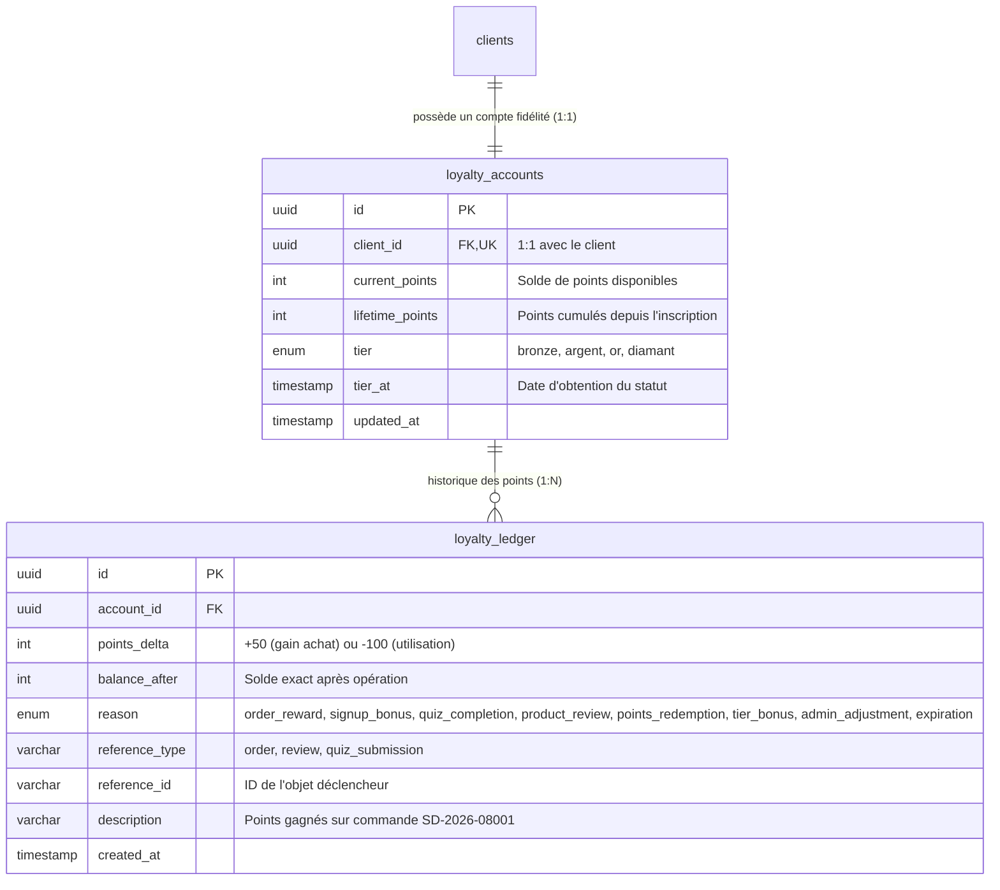

### Explication des tables et de leurs usages :
1. **`loyalty_accounts`** : Solde actuel et palier de fidélité du client (`tier` : Bronze, Argent, Or, Diamant).
2. **`loyalty_ledger`** : Journal comptable inaltérable des gains et dépenses de points. Chaque modification (`points_delta`) garantit la conservation du solde historique (`balance_after`), protégeant contre toute fraude ou désynchronisation.

---

## 9. Module 8 : Promotions, Avis Clients & UGC

Gère les codes promotionnels, les avis produits vérifiés, les témoignages de marque et les inscriptions à la newsletter.

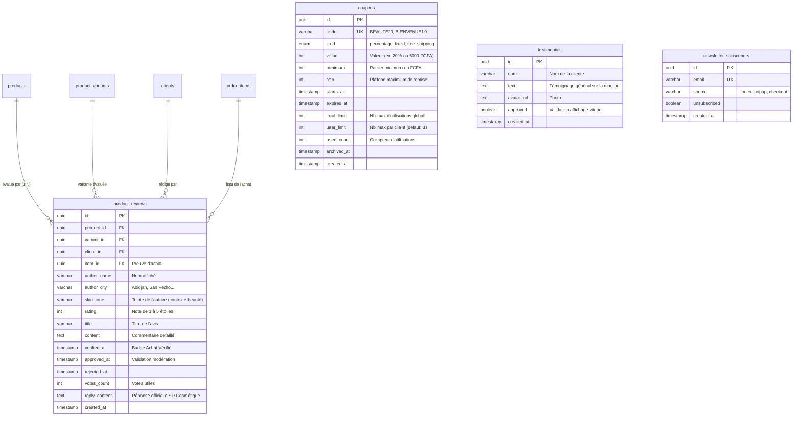

### Explication des tables et de leurs usages :
1. **`coupons`** : Gestion des codes de réduction (remise en %, montant fixe en FCFA ou livraison offerte) avec contraintes d'usage strictes.
2. **`product_reviews`** : Système d'avis et notation UGC (*User Generated Content*). Inclut la teinte de peau de l'autrice (`skin_tone`) pour aider les autres clientes à se projeter, ainsi que la modération et le badge "Achat vérifié".
3. **`testimonials` (Décision C11)** : Témoignages généraux de marque affichés sur la page d'accueil (découplés des produits spécifiques).
4. **`newsletter_subscribers` (Décision C11)** : Liste d'adresses emails collectées via les formulaires publics du site, sans exiger la création préalable d'un compte utilisateur.

---

## 10. Module 9 : Diagnostic de Peau (Quiz & Recommandations)

Moteur intelligent de diagnostic cosmétique en ligne. Il pose une série de questions, évalue les réponses via des règles pondérées (`quiz_rules`) et délivre une routine de soins personnalisée sur-mesure.

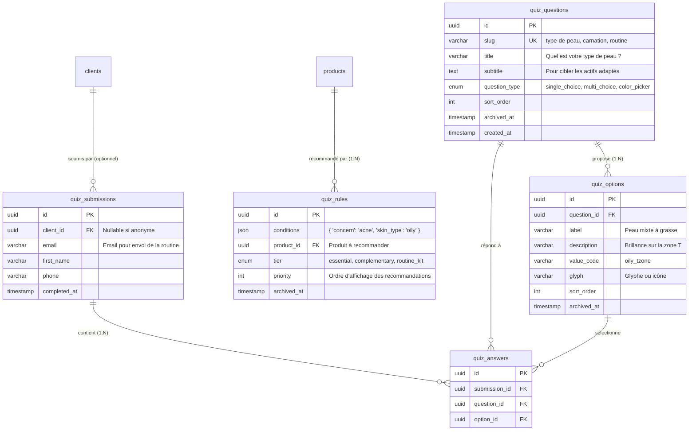

### Explication des tables et de leurs usages :
1. **`quiz_questions` & `quiz_options`** : Structure dynamique du questionnaire de diagnostic (choix unique, choix multiple, palette visuelle de carnations).
2. **`quiz_rules`** : Moteur de recommandation. Associe un ensemble de conditions (critères cutanés sélectionnés) à un produit recommandé (`product_id`) et à son rôle dans la routine (`tier` : soin essentiel, soin complémentaire, kit complet).
3. **`quiz_submissions` & `quiz_answers`** : Enregistrement de la session du visiteur et de ses réponses individuelles pour lui renvoyer sa prescription de soins par email ou WhatsApp.

---

## 11. Module 10 : Tables Polymorphes Transverses

Ces tables transversales sont réutilisables par n'importe quelle entité du système grâce aux colonnes polymorphes (`*_type` et `*_id`).

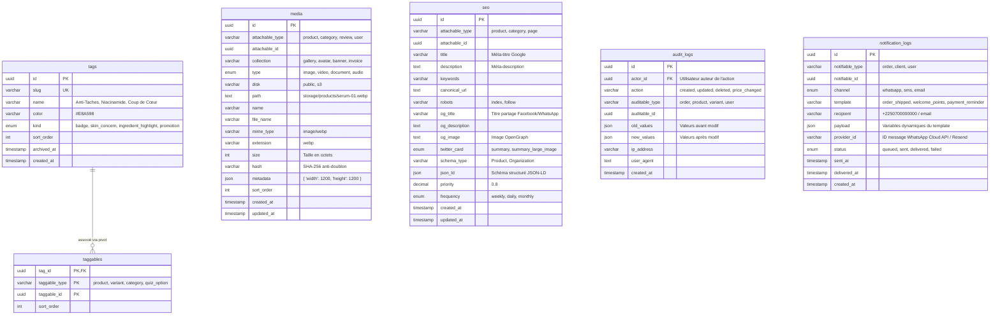

### Explication des tables et de leurs usages :
1. **`tags` & `taggables`** : Système d'étiquetage universel. Permet d'associer des badges visuels ("Nouveau", "Promo"), des préoccupations de peau ("Acné", "Teint terne") ou des ingrédients phares à n'importe quel produit ou catégorie sans modifier la table source.
2. **`media`** : Gestionnaire de fichiers unifié (stockage Laravel Storage). Remplace les colonnes JSON d'images. Gère les galeries produits, les bannières de catégories, les avatars et les photos des avis clients.
3. **`seo`** : Métadonnées SEO universelles 1:1 pour les fiches produits, les catégories et les pages de contenu (balises OpenGraph, Twitter Cards, Schema.org JSON-LD).
4. **`audit_logs`** : Journalisation de sécurité des actions administrateurs dans le back-office Filament (qui a modifié un prix, qui a validé une commande, qui a remboursé un client) avec sauvegarde des états avant/après (`old_values` / `new_values`).
5. **`notification_logs` (Décision C13)** : Journalisation des notifications transactionnelles sortantes (WhatsApp Cloud API, SMS Orange/MTN, Emails Resend). Permet de tracer la délivrabilité effective (`delivered_at`) et d'éviter les doubles envois intempestifs.

---

## 12. Module 11 : Paramètres & Configuration Système

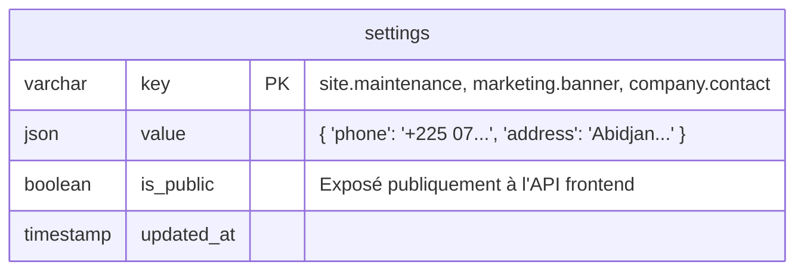

### Explication de la table et de ses usages :
1. **`settings` (Décision C3)** : Table clé-valeur centrale remplaçant l'ancienne table `site_config`.
   - **Sécurité (`is_public`)** : Le champ booléen `is_public` permet au contrôleur de l'API de n'exposer au site public Next.js que les configurations autorisées (bannières d'annonce, coordonnées de contact, message de livraison gratuite), tout en gardant les réglages sensibles réservés au back-office Filament.

---

## 13. Patterns Architecturaux & Règles d'Intégrité

### 13.1 Conventions de nommage et Types SQL
- **Identifiants Primaires (PK)** : 100% `UUID v4` (`varchar(36)`) sur les tables métier pour éviter l'énumération séquentielle des commandes ou des clients. Seules les tables de configuration clé-valeur (`settings`) et sessions utilisent des clés textuelles spécifiques.
- **Monnaie & Montants Financiers** : Toujours des entiers (`integer`) représentant l'unité monétaire en Francs CFA (XOF), sans virgule flottante (ex: `15000` pour 15 000 FCFA).
- **Règle 100% `snake_case`** : Tous les noms de colonnes et tables SQL ainsi que les propriétés des modèles Eloquent / TypeScript sont strictement en `snake_case`.
- **Enums applicatifs** : Stockés sous forme de `varchar(32)` ou `string` en base de données et castés via des Backed Enums PHP dans Laravel pour garantir la compatibilité absolue entre SQLite (développement/tests) et MariaDB (production).

### 13.2 Stratégies d'intégrité référentielle (Foreign Keys)
- `cascadeOnDelete()` : Utilisé pour les dépendances strictes (ex: suppression d'une commande ➔ suppression de ses `order_items` et `order_adjustments` ; suppression d'un produit ➔ suppression de ses `product_variants`).
- `nullOnDelete()` : Utilisé pour préserver l'historique légal et financier (ex: suppression d'un compte client ➔ la commande reste conservée avec `orders.client_id = NULL` grâce au snapshot `order_customers`).
- `restrictOnDelete()` : Utilisé sur les tables financières critiques (ex: interdiction de supprimer une passerelle `payment_gateways` si des transactions `payment_transactions` y sont rattachées).

---

## 14. Matrice Récapitulative des 44 Tables

| # | Nom de la Table | Module | Clé Primaire | Relations Clés | Rôle & Utilité Principale |
| :--- | :--- | :--- | :--- | :--- | :--- |
| 1 | `users` | IAM | UUID | `clients`, `roles`, `sessions` | Comptes d'authentification uniques |
| 2 | `clients` | IAM | UUID | `users` (1:1), `orders`, `loyalty_accounts` | Profil beauté & carnation du client |
| 3 | `roles` | IAM | UUID | `role_user` (N:N) | Rôles d'accès RBAC |
| 4 | `role_user` | IAM | Composite | `users`, `roles` | Table de liaison utilisateurs-rôles |
| 5 | `sessions` | IAM | Varchar | `users` | Sessions de connexion Sanctum SPA |
| 6 | `addresses` | Logistique | UUID | Polymorphe (`client`, `order`...) | Adresses de livraison avec repères CI |
| 7 | `shipping_zones` | Logistique | Varchar | — | Grille tarifaire et seuils de livraison |
| 8 | `categories` | Catalogue | UUID | `categories` (parent_id), `products` | Catégories arborescentes de soins |
| 9 | `products` | Catalogue | UUID | `categories`, `product_variants` | Fiches produits maîtresses |
| 10 | `product_categories` | Catalogue | Composite | `products`, `categories` | Pivot d'association produit-catégorie |
| 11 | `product_variants` | Catalogue | UUID | `products`, `inventory_items`, `attributes` | Déclinaisons SKU, prix et teintes |
| 12 | `attributes` | Catalogue | UUID | `attribute_values` | Types d'attributs (Teinte, Contenance) |
| 13 | `attribute_values` | Catalogue | UUID | `attributes`, `variant_attribute_values` | Valeurs d'attributs avec pastille hex |
| 14 | `variant_attribute_values` | Catalogue | Composite | `product_variants`, `attribute_values` | Liaison variante à ses attributs |
| 15 | `inventory_items` | Inventaire | UUID | `product_variants` (1:1) | État instantané du stock physique/réservé |
| 16 | `stock_movements` | Inventaire | UUID | `inventory_items`, `users` | Grand livre comptable des stocks |
| 17 | `orders` | Ventes | UUID | `clients`, `order_customers`, `order_items` | Commande maîtresse (subtotal & total) |
| 18 | `order_customers` | Ventes | UUID | `orders` (1:1) | Snapshot figé des coordonnées acheteur |
| 19 | `order_adjustments` | Ventes | UUID | `orders` (1:N) | Frais de port, remises, réductions |
| 20 | `order_items` | Ventes | UUID | `orders`, `product_variants` | Articles commandés avec photo JSON |
| 21 | `shipments` | Logistique | UUID | `orders`, `shipment_items` | Colis, livreurs moto et suivi |
| 22 | `shipment_items` | Logistique | UUID | `shipments`, `order_items` | Détail des articles par colis |
| 23 | `order_status_history` | Ventes | UUID | `orders`, `users` | Historique daté des statuts de commande |
| 24 | `payment_gateways` | Fintech | UUID | `payment_transactions` | Modes de paiement (Wave, OM, MoMo...) |
| 25 | `payment_transactions` | Fintech | UUID | `orders`, `payment_gateways` | Transactions bancaires / Mobile Money |
| 26 | `payment_webhook_logs` | Fintech | UUID | `payment_gateways` | Journal brut des retours webhooks |
| 27 | `loyalty_accounts` | Fidélité | UUID | `clients` (1:1) | Solde de points et palier du client |
| 28 | `loyalty_ledger` | Fidélité | UUID | `loyalty_accounts` | Grand livre inaltérable des points Jeko |
| 29 | `coupons` | Marketing | UUID | `orders` | Codes promo et conditions d'usage |
| 30 | `product_reviews` | UGC | UUID | `products`, `clients`, `order_items` | Avis clients avec teinte et vérification |
| 31 | `testimonials` | Marketing | UUID | — | Témoignages généraux de la marque |
| 32 | `newsletter_subscribers` | Marketing | UUID | — | Abonnés email hors compte client |
| 33 | `quiz_questions` | Diagnostic | UUID | `quiz_options` | Questions du diagnostic de peau |
| 34 | `quiz_options` | Diagnostic | UUID | `quiz_questions` | Options de réponses avec glyphes |
| 35 | `quiz_rules` | Diagnostic | UUID | `products` | Moteur de règles de recommandation |
| 36 | `quiz_submissions` | Diagnostic | UUID | `clients`, `quiz_answers` | Fiches diagnostics soumises |
| 37 | `quiz_answers` | Diagnostic | UUID | `quiz_submissions`, `quiz_options` | Réponses détaillées de la session |
| 38 | `tags` | Transverse | UUID | `taggables` | Badges, besoins cutanés, actifs |
| 39 | `taggables` | Transverse | Composite | Polymorphe (`tags`) | Pivot polymorphe universel |
| 40 | `media` | Transverse | UUID | Polymorphe | Gestionnaire de fichiers/images unifié |
| 41 | `seo` | Transverse | UUID | Polymorphe | Métadonnées Google et réseaux sociaux |
| 42 | `audit_logs` | Sécurité | UUID | `users`, Polymorphe | Traçabilité des actions back-office |
| 43 | `notification_logs` | Notification | UUID | Polymorphe | Journal d'envoi WhatsApp / SMS / Email |
| 44 | `settings` | Système | Varchar | — | Paramètres clé-valeur publics/privés |
