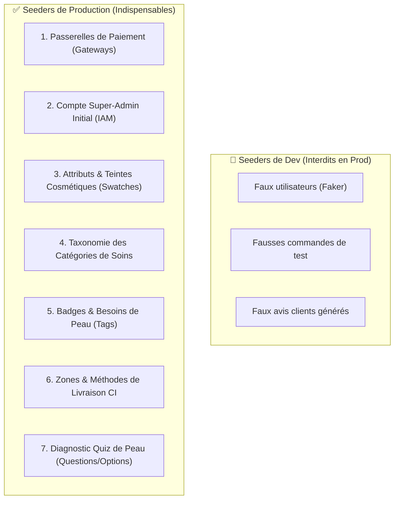

# Spécification des Seeders Obligatoires en Production (Baseline Data)

> Spécification de référence du **Milestone 02** ([plan d'implémentation](../implementation-plan/milestone-02-schema-and-production-seeders.md)).
> Chaque seeder ci-dessous doit écrire dans une table réellement déclarée dans [`target-schema.md`](./target-schema.md).

Contrairement aux *Fake / Dummy Seeders* (utilisés uniquement en local pour générer 100 fausses commandes ou utilisateurs fictifs), les **Seeders de Production (*System / Reference Data*)** contiennent les données de référence indispensables pour que l'application démarre et fonctionne au jour 1.

Tous les objets TypeScript utilisent désormais **strictement les clés en `snake_case`**, identiques aux colonnes Drizzle ORM et MySQL.

---

## 1. Règle Fondamentale : L'Idempotence des Seeders Prod

> **Règle d'or** : Un seeder de production doit être **strictement idempotent**. Il peut être exécuté 10 fois d'affilée sans créer de doublons, sans écraser les modifications manuelles de l'administrateur, grâce à la clause `ON DUPLICATE KEY UPDATE` ou `upsert()`.



---

## 2. Liste Exhaustive des Seeders de Production (100% snake_case)

> **6 seeders actifs + 1 en attente de décision** (seeder 6, cf. ci-dessous).

### 1. Passerelles de Paiement (`payment_gateways`)
Indispensable pour permettre le checkout dès le lancement sans configuration manuelle laborieuse.

```typescript
export const payment_gateways_seed = [
  {
    id: 'gw-wave',
    code: 'wave',
    name: 'Wave',
    description: 'Paiement instantané sans frais via QR code ou numéro Wave',
    instructions: 'Validez la notification Push sur votre application Wave.',
    fee_type: 'none',
    fee_value: 0,
    min_amount: 100,
    mode: 'live',
    sort_order: 1,
  },
  {
    id: 'gw-om',
    code: 'orange_money',
    name: 'Orange Money CI',
    description: 'Paiement sécurisé Orange Money Côte d\'Ivoire',
    instructions: 'Composez le #144*82# pour générer votre code d\'autorisation.',
    fee_type: 'none',
    fee_value: 0,
    min_amount: 100,
    mode: 'live',
    sort_order: 2,
  },
  {
    id: 'gw-mtn',
    code: 'mtn_momo',
    name: 'MTN MoMo',
    description: 'Paiement Mobile Money MTN',
    instructions: 'Confirmez le débit sur votre téléphone après validation.',
    fee_type: 'none',
    fee_value: 0,
    min_amount: 100,
    mode: 'live',
    sort_order: 3,
  },
  {
    id: 'gw-moov',
    code: 'moov_money',
    name: 'Moov Money',
    description: 'Paiement Moov Money Côte d\'Ivoire',
    instructions: 'Validez le débit sur le prompt USSD.',
    fee_type: 'none',
    fee_value: 0,
    min_amount: 100,
    mode: 'live',
    sort_order: 4,
  },
  {
    id: 'gw-djamo',
    code: 'djamo',
    name: 'Djamo',
    description: 'Paiement par compte Djamo',
    instructions: 'Validez le paiement directement dans votre application Djamo.',
    fee_type: 'none',
    fee_value: 0,
    min_amount: 100,
    mode: 'live',
    sort_order: 5,
  },
  {
    id: 'gw-cod',
    code: 'cash_on_delivery',
    name: 'Paiement à la livraison',
    description: 'Règlement en espèces auprès de notre livreur à la réception',
    instructions: 'Préparez l\'appoint en espèces lors de la livraison.',
    fee_type: 'none',
    fee_value: 0,
    min_amount: 500,
    mode: 'live',
    sort_order: 6,
  },
];
```

---

### 2. Compte Super-Administrateur Initial (`users`, `admins`)

```typescript
export async function seed_initial_admin(db: any) {
  const admin_id = 'usr-super-admin-01';
  const email = process.env.SEED_ADMIN_EMAIL || 'admin@sdcosmetique.ci';
  const password = process.env.SEED_ADMIN_PASSWORD_HASH;

  // 1. Identité utilisateur
  await db.insert(users).values({
    id: admin_id,
    first_name: 'Super',
    last_name: 'Admin',
    email: email,
    phone: '+2250700000000',
    password: password,
    verified_at: new Date(),
  }).onDuplicateKeyUpdate({ set: { email: email } });

  // 2. Élévation de privilèges
  await db.insert(admins).values({
    id: 'adm-super-admin-01',
    user_id: admin_id,
    role: 'super_admin',
    root_at: new Date(),
  }).onDuplicateKeyUpdate({ set: { role: 'super_admin' } });
}
```

---

### 3. Attributs Cosmétiques & Teintes de Peau (`attributes`, `attribute_values`)

```typescript
export const attributes_seed = [
  { id: 'attr-skin-tone', code: 'skin_tone', name: 'Carnation & Teinte', sort_order: 1 },
  { id: 'attr-volume', code: 'volume', name: 'Contenance / Format', sort_order: 2 },
];

export const attribute_values_seed = [
  // Teintes de peau avec codes hexadécimaux
  { id: 'val-tone-noir', attribute_id: 'attr-skin-tone', value: 'noir', label: 'Peau Noire Ébène', hex_color: '#2B1A13', sort_order: 1 },
  { id: 'val-tone-marron', attribute_id: 'attr-skin-tone', value: 'marron', label: 'Peau Marron Foncé', hex_color: '#4A2E1F', sort_order: 2 },
  { id: 'val-tone-marron-clair', attribute_id: 'attr-skin-tone', value: 'marron_clair', label: 'Peau Marron Clair', hex_color: '#7A4B31', sort_order: 3 },
  { id: 'val-tone-metisse', attribute_id: 'attr-skin-tone', value: 'metisse', label: 'Peau Métissée / Châtain', hex_color: '#A8744F', sort_order: 4 },
  { id: 'val-tone-claire', attribute_id: 'attr-skin-tone', value: 'claire', label: 'Peau Claire', hex_color: '#D5A77D', sort_order: 5 },

  // Volumes
  { id: 'val-vol-50ml', attribute_id: 'attr-volume', value: '50ml', label: 'Flacon 50 ml', sort_order: 1 },
  { id: 'val-vol-100ml', attribute_id: 'attr-volume', value: '100ml', label: 'Flacon 100 ml', sort_order: 2 },
  { id: 'val-vol-200ml', attribute_id: 'attr-volume', value: '200ml', label: 'Pot 200 ml', sort_order: 3 },
  { id: 'val-vol-500ml', attribute_id: 'attr-volume', value: '500ml', label: 'Format Éco 500 ml', sort_order: 4 },
];
```

---

### 4. Catégories Maîtresses du Catalogue (`categories`)

```typescript
export const categories_seed = [
  { id: 'cat-visage', name: 'Soins du Visage', slug: 'soins-visage', icon: 'face', sort_order: 1 },
  { id: 'cat-corps', name: 'Soins du Corps', slug: 'soins-corps', icon: 'body', sort_order: 2 },
  { id: 'cat-serums', name: 'Sérums & Boosters', slug: 'serums-boosters', icon: 'droplet', sort_order: 3 },
  { id: 'cat-savons', name: 'Savons & Nettoyants', slug: 'savons-nettoyants', icon: 'sparkle', sort_order: 4 },
  { id: 'cat-solaires', name: 'Protection Solaire', slug: 'protection-solaire', icon: 'sun', sort_order: 5 },
  { id: 'cat-routines', name: 'Packs & Routines Complètes', slug: 'packs-routines', icon: 'package', sort_order: 6 },
];
```

---

### 5. Badges & Préoccupations de Peau Système (`tags`)

```typescript
export const system_tags_seed = [
  // Badges Marketing
  { id: 'tag-bestseller', slug: 'bestseller', name: 'Bestseller', color: '#D97706', kind: 'badge', sort_order: 1 },
  { id: 'tag-nouveau', slug: 'nouveau', name: 'Nouveauté', color: '#059669', kind: 'badge', sort_order: 2 },
  { id: 'tag-coup-de-coeur', slug: 'coup-de-coeur', name: 'Coup de Cœur', color: '#DC2626', kind: 'badge', sort_order: 3 },
  { id: 'tag-bio', slug: 'bio-naturel', name: '100% Naturel', color: '#16A34A', kind: 'badge', sort_order: 4 },

  // Besoins de Peau
  { id: 'tag-anti-taches', slug: 'anti-taches', name: 'Anti-Taches & Hyperpigmentation', color: '#7C3AED', kind: 'skin_concern', sort_order: 10 },
  { id: 'tag-eclat', slug: 'eclat-teint', name: 'Éclat du Teint', color: '#EA580C', kind: 'skin_concern', sort_order: 11 },
  { id: 'tag-acne', slug: 'acne-imperfections', name: 'Acné & Pores Dilatés', color: '#2563EB', kind: 'skin_concern', sort_order: 12 },
  { id: 'tag-hydratation', slug: 'hydratation', name: 'Hydratation & Nutrition', color: '#0891B2', kind: 'skin_concern', sort_order: 13 },
  { id: 'tag-anti-age', slug: 'anti-age', name: 'Anti-Âge & Fermeté', color: '#4F46E5', kind: 'skin_concern', sort_order: 14 },
];
```

---

### 6. Zones Géographiques de Livraison — ⚠️ EN ATTENTE DE DÉCISION

> **Bloquant** : les tables `shipping_zones` et `shipping_methods` **n'existent dans aucune spécification de schéma**, y compris [`target-schema.md`](./target-schema.md) (37 tables).
> Le schéma actuel ne porte les frais de port que sous forme d'un montant plat `orders.shipping`.
> Deux options, à trancher avant le Milestone 02 :
> 1. **Ajouter 2 tables** (`shipping_zones`, `shipping_methods`) au module 6 du schéma cible, plus `orders.method_id` ➔ 39 tables.
> 2. **Reporter** : conserver `orders.shipping` en montant calculé côté application, et retirer ce seeder de la liste ➔ 6 seeders de production.
>
> Tant que la décision n'est pas prise, ce seeder **ne doit pas** être compté dans la *Definition of Done* du Milestone 02.


```typescript
export const shipping_zones_seed = [
  { id: 'zone-abidjan', name: 'Abidjan Intra-muros', country: 'CI' },
  { id: 'zone-interieur', name: 'Villes de l\'Intérieur (Bouaké, Yamoussoukro, San-Pédro, Korhogo)', country: 'CI' },
];

export const shipping_methods_seed = [
  { id: 'sm-abj-express', zone_id: 'zone-abidjan', name: 'Livraison Express Moto (24h-48h)', price: 1500, min_hours: 24, max_hours: 48 },
  { id: 'sm-abj-relais', zone_id: 'zone-abidjan', name: 'Retrait en Boutique / Point Relais Cocody', price: 0, min_hours: 2, max_hours: 12 },
  { id: 'sm-int-transport', zone_id: 'zone-interieur', name: 'Expédition Gare / Car Transporteur', price: 3000, min_hours: 48, max_hours: 72 },
];
```

---

### 7. Questions & Options du Diagnostic de Peau (`quiz_questions`, `quiz_options`)

Alimente le moteur de quiz dynamique (module 10 du schéma cible). Les questions sont identifiées
par leur `slug` (clé d'idempotence) et les options par le couple `(question_id, value_code)`.

```typescript
export const quiz_questions_seed = [
  {
    id: 'qz-q-skin-type',
    slug: 'skin_type',
    title: 'Quel est votre type de peau au naturel ?',
    subtitle: 'Observez votre peau en fin de journée, sans maquillage.',
    question_type: 'single_choice',
    sort_order: 1,
  },
  {
    id: 'qz-q-main-concern',
    slug: 'main_concern',
    title: 'Quelle est votre préoccupation beauté prioritaire ?',
    subtitle: null,
    question_type: 'single_choice',
    sort_order: 2,
  },
  {
    id: 'qz-q-skin-tone',
    slug: 'skin_tone',
    title: 'Quelle est votre carnation ?',
    subtitle: null,
    question_type: 'color_picker',
    sort_order: 3,
  },
];

export const quiz_options_seed = [
  // ── skin_type ──────────────────────────────────────────────────────────────
  { id: 'qz-o-grasse',        question_id: 'qz-q-skin-type',    value_code: 'grasse',         label: 'Grasse',            description: 'Brille sur l\'ensemble du visage',            glyph: '◯', sort_order: 1 },
  { id: 'qz-o-mixte',         question_id: 'qz-q-skin-type',    value_code: 'mixte',          label: 'Mixte',             description: 'Zone T brillante, joues normales',            glyph: '◐', sort_order: 2 },
  { id: 'qz-o-seche',         question_id: 'qz-q-skin-type',    value_code: 'seche',          label: 'Sèche',             description: 'Tiraillements, manque de confort',            glyph: '◇', sort_order: 3 },
  { id: 'qz-o-sensible',      question_id: 'qz-q-skin-type',    value_code: 'sensible',       label: 'Sensible',          description: 'Rougeurs, peau réactive',                     glyph: '△', sort_order: 4 },

  // ── main_concern ───────────────────────────────────────────────────────────
  { id: 'qz-o-anti-taches',   question_id: 'qz-q-main-concern', value_code: 'anti_taches',    label: 'Anti-taches',       description: 'Atténuer les taches brunes et l\'hyperpigmentation', glyph: '◯', sort_order: 1 },
  { id: 'qz-o-eclat',         question_id: 'qz-q-main-concern', value_code: 'eclat',          label: 'Éclat du teint',    description: 'Retrouver un teint lumineux et unifié',       glyph: '✦', sort_order: 2 },
  { id: 'qz-o-acne',          question_id: 'qz-q-main-concern', value_code: 'acne',           label: 'Imperfections',     description: 'Éliminer les boutons et lisser le grain',     glyph: '◇', sort_order: 3 },
  { id: 'qz-o-hydratation',   question_id: 'qz-q-main-concern', value_code: 'hydratation',    label: 'Hydratation',       description: 'Hydrater intensément sans effet gras',        glyph: '◈', sort_order: 4 },

  // ── skin_tone ──────────────────────────────────────────────────────────────
  { id: 'qz-o-ebene',         question_id: 'qz-q-skin-tone',    value_code: 'ebene',          label: 'Ébène',             description: 'Peau noire profonde',                         glyph: '●', sort_order: 1 },
  { id: 'qz-o-marron',        question_id: 'qz-q-skin-tone',    value_code: 'marron',         label: 'Marron foncé',      description: 'Peau brune soutenue',                         glyph: '●', sort_order: 2 },
  { id: 'qz-o-marron-clair',  question_id: 'qz-q-skin-tone',    value_code: 'marron_clair',   label: 'Marron clair',      description: 'Peau brune lumineuse',                        glyph: '●', sort_order: 3 },
  { id: 'qz-o-claire',        question_id: 'qz-q-skin-tone',    value_code: 'claire',         label: 'Métissée / Claire', description: 'Peau claire à métissée',                      glyph: '●', sort_order: 4 },
];

export async function seed_quiz_questions(db: any) {
  for (const question of quiz_questions_seed) {
    await db.insert(quiz_questions).values(question)
      .onDuplicateKeyUpdate({
        set: {
          title: question.title,
          subtitle: question.subtitle,
          question_type: question.question_type,
          sort_order: question.sort_order,
        },
      });
  }

  for (const option of quiz_options_seed) {
    await db.insert(quiz_options).values(option)
      .onDuplicateKeyUpdate({
        set: {
          label: option.label,
          description: option.description,
          glyph: option.glyph,
          sort_order: option.sort_order,
        },
      });
  }
}
```

> **Note ETL** : les tables héritées `quiz_concerns` et `quiz_routines` alimentent les mêmes
> `quiz_options` (voir Milestone 09). Les `value_code` ci-dessus doivent donc rester alignés
> sur les `id` des lignes existantes de `quiz_concerns` pour préserver les soumissions passées.

---

## 3. Synthèse des Commandes d'Exécution

```typescript
export async function run_production_seeds(db: any) {
  console.log('🚀 Exécution des Seeders de Production...');
  
  await seed_payment_gateways(db);
  await seed_initial_admin(db);
  await seed_attributes_and_values(db);
  await seed_categories(db);
  await seed_system_tags(db);
  // await seed_shipping_zones(db); // ⚠️ bloqué : tables absentes du schéma cible (cf. seeder 6)
  await seed_quiz_questions(db);
  
  console.log('✨ Base de données de production initialisée avec succès !');
}
```
